[TensorFlow] Protein Interface Prediction using Graph Convolutional Networks
=====

## Result

### Training

  

    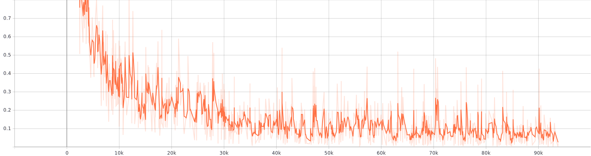
  

  
Loss graph.

### Test

  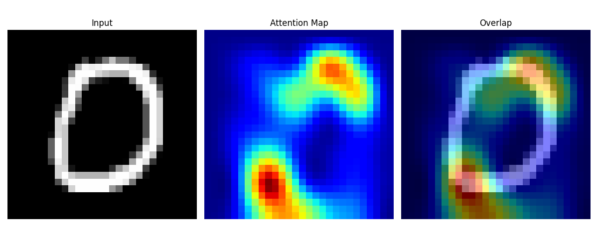
  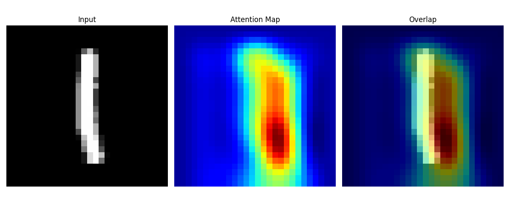 
  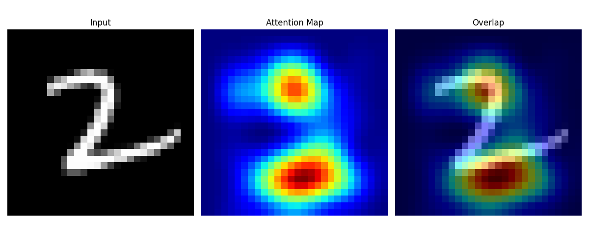  
  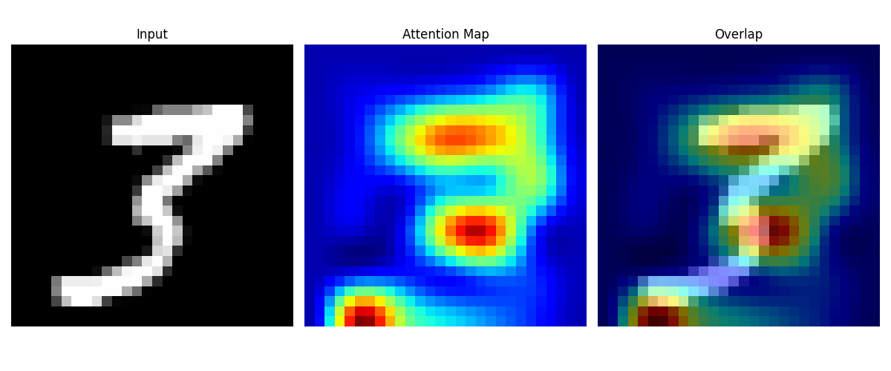 
  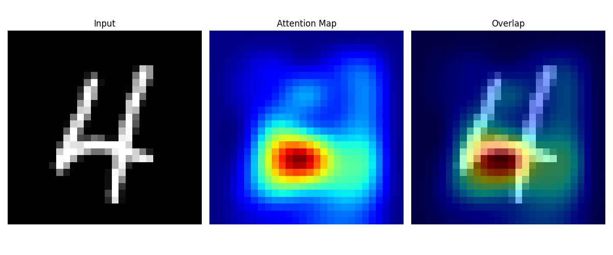
  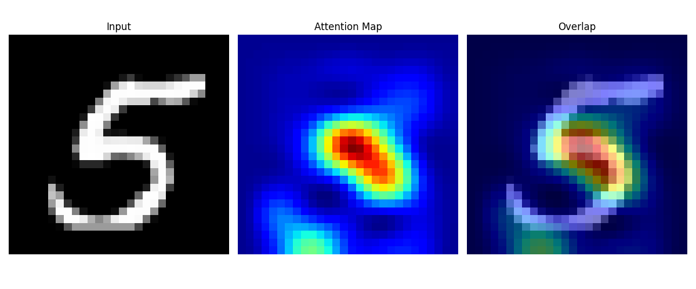   
  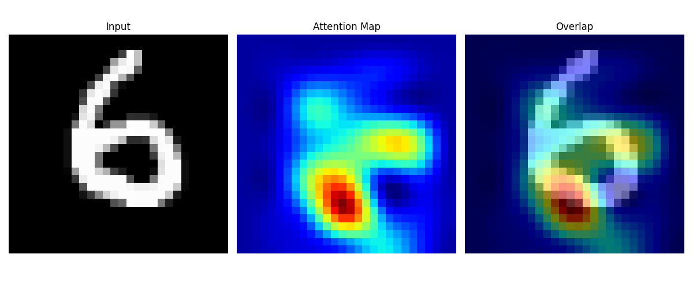
  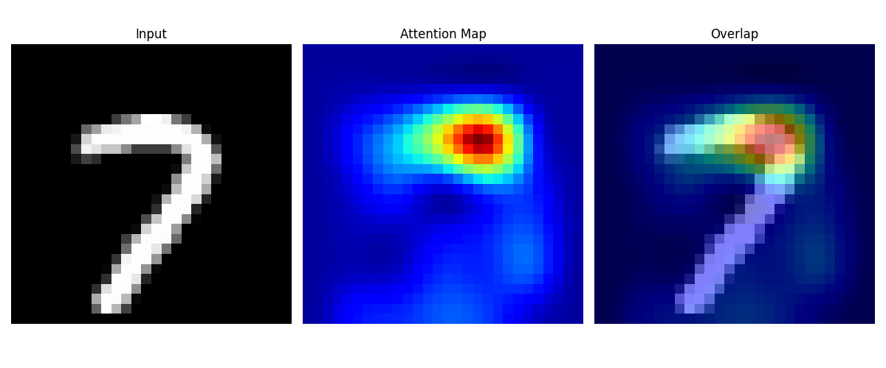   
  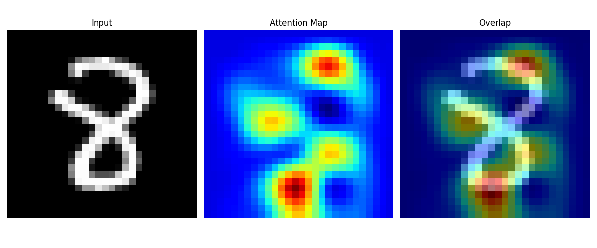
  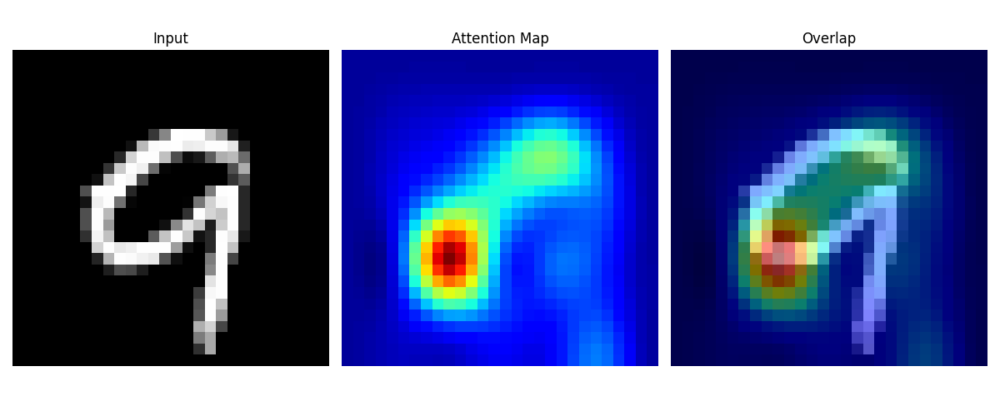   
  
Each figure shows input digit, attention map, and overlapped image sequentially.

### Further usage

  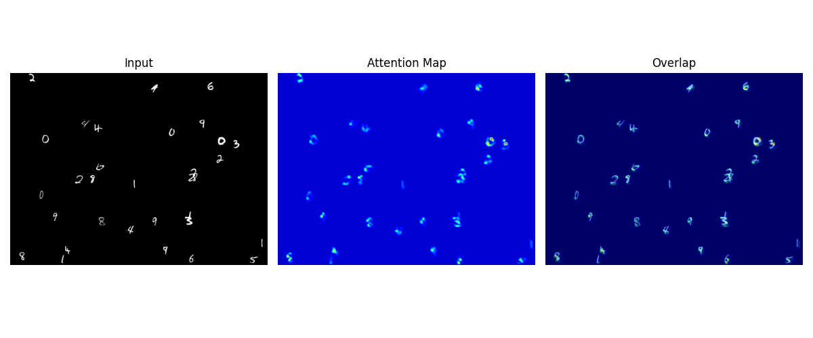 
  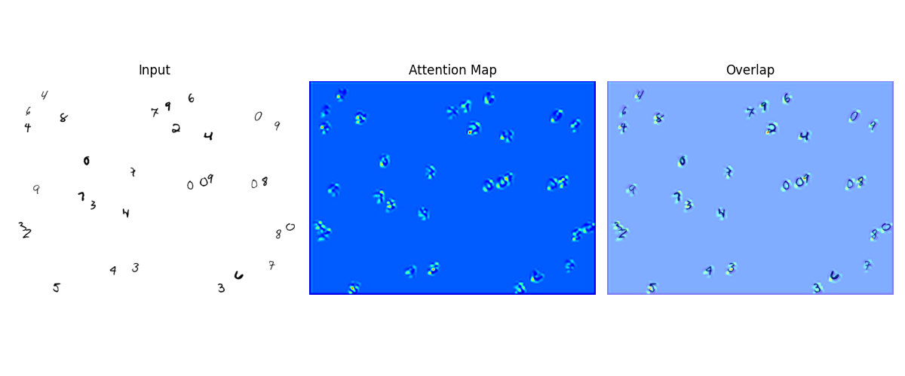 
  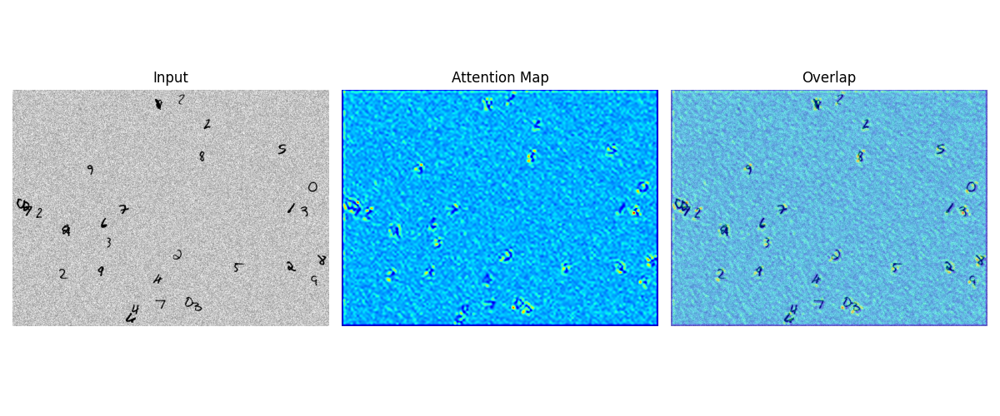 
  
The further usages. Detecting the location of digits can be conducted using an attention map.

## Requirements
* TensorFlow 2.3.0  
* Numpy 1.18.5

## Additional Resources
[1] <a href="https://github.com/kjm1559/simple_attention">Simple attention mechanism test</a> by Myung Jin Kim
